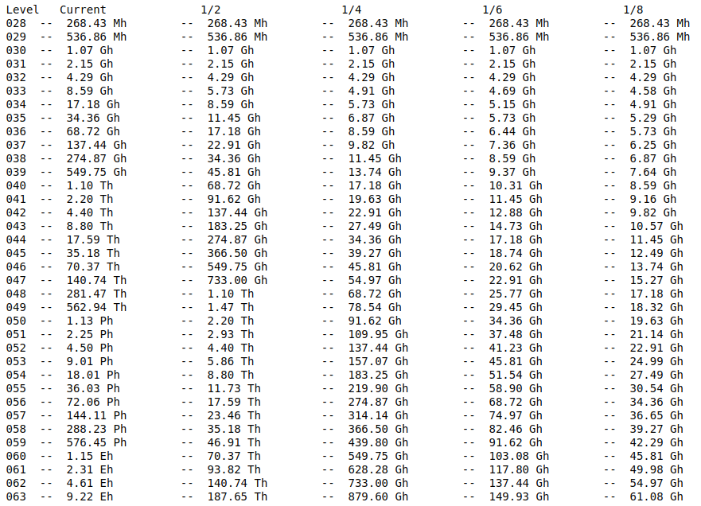
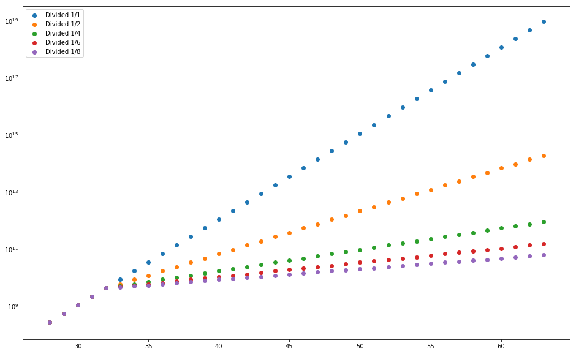

# Difficulty Adjustment

Adjust difficulty level of PoW at the end of each DS epoch according to the number of PoW submissions. With a higher difficulty, it can make malicious attack more difficult. And keep the nodes with the most powerful hardware in the network.

## Adjustment procedure

1. When we bootstrap the system, every node reads the difficulty level from the constant file. After that, every node will update the difficulty level at the first txn epoch of each DS epoch.
1. At the beginning of each DS epoch, every DS node will receive PoW submissions and record them. When a DS leader proposes a dsblock, it will call "CalculateNewDifficulty" and “CalculateNewDSDifficulty” to generate a difficulty to replace the field in dsblock and announce it to every DS backup node in DS block consensus protocol.
1. A DS backup node receives the announcement, and calculates the new difficulty by calling "CalculateNewDifficulty" and “CalculateNewDSDifficulty” as well as compares the result with the one proposed by DS leader. If it matches, it will accept it and continue the consensus protocol. Otherwise, it refuses to reply the leader, which may trigger view change.
1. Once DS generates the dsblock with new difficulty, DS will broadcast it to shards. Every shard node will accept the new difficulty and use it to do PoW for next DS epoch.
1. A new node will also get the new difficulty from lookup nodes by retrieving the latest DS block.

## Adjustment formula and parameters

There are 4 constants variables used to calculate the difficulty. 'POW_CHANGE_TO_ADJ_DIFF', 'POW_CHANGE_TO_ADJ_DS_DIFF', 'EXPECTED_SHARD_NODE_NUM' and 'NUM_DS_ELECTION'. And there are two dymanic parameters are number of shard PoW submissions and number of DS PoW submissions. The basic formulas to caluclate new difficulty are as below.

```C++
New shard difficulty = Current Difficulty + (Shard PoW Submissions - EXPECTED_SHARD_NODE_NUM) / POW_CHANGE_TO_ADJ_DIFF
New DS difficulty = Current DS Difficulty + (DS PoW Submissions - NUM_DS_ELECTION) / POW_CHANGE_TO_ADJ_DS_DIFF
```

The rationale of the formula is when there are more PoW submissions than the expected number, then increase difficulty. When there are less PoW submissions than the expected number, then decrease the difficulty.

## Difficulty subdivide

When difficulty increase by one, the required hash power to finish PoW will be doubled. When the difficulty is very high, if still adjust the difficulty by doubling the hash power will make a lot of the miners fail to do PoW, and it will affect the stability and throughput of the blockchain. So we added a threshold to subdivide the difficulty. There are two constant parameters 'POW_BOUNDARY_N_DIVIDED_START' and 'POW_BOUNDARY_N_DIVIDED' defined for it. When current difficulty exceeds 'POW_BOUNDARY_N_DIVIDED_START', every difficulty level will subdivide to 'POW_BOUNDARY_N_DIVIDED' sub-levels. The required hash power increase will only by 1/'POW_BOUNDARY_N_DIVIDED' of current hash power. It can make the hash power increase in a more smooth pace.  
The rationale behind this is we changed the method to calculate target boundary from 'POW_BOUNDARY_N_DIVIDED_START'. When the difficulty under 'POW_BOUNDARY_N_DIVIDED_START', every time we increase difficulty, we put one more '0' at the MSB of target boundary, but if difficulty exceed 'POW_BOUNDARY_N_DIVIDED_START', we put '0's at the LSB of the target boundary.  
The implementation can be found in function DifficultyLevelInIntDevided.  
Here is the bench mark of the hash power required if POW_BOUNDARY_N_DIVIDED_START is 32 and POW_BOUNDARY_N_DIVIDED_START is 1, 2, 4, 6, 8  



## Reference

1. [Difficulty divide](https://mybinder.org/v2/gh/deepgully/jupyter/master?filepath=Zilliqa%2Fdifficulty.ipynb)