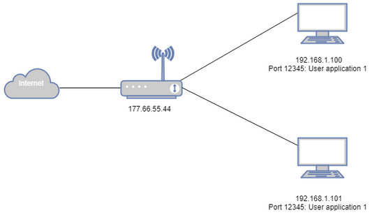
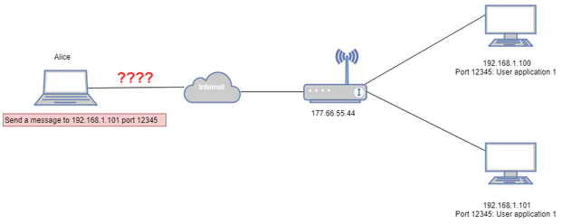
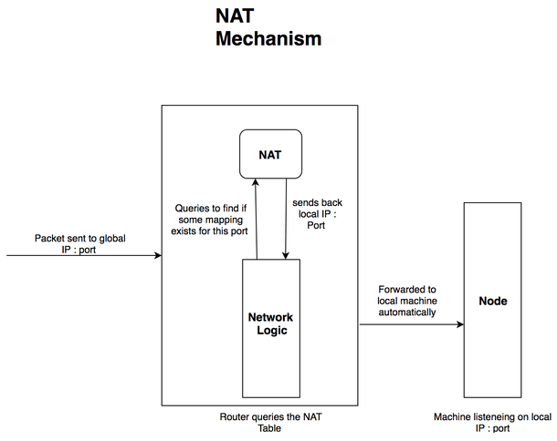

# NAT Resolver

As a result of IPv4 address scarcity, most home internet gateway devices (IGD) such as “home routers” and “switches” use network address translation (NAT) to map a public IP address assigned by the internet service provider (ISP) to a private network such as a local area network (LAN).

This means that a node behind such devices will be assigned a private IP address and the gateway will route the traffic to and from the outside world. As such, external nodes in the Internet are unable to route messages to node before devices with NAT. For instance, in the diagram below, when Alice wants to route a message to `192.168.1.101:12345`, Alice is unable to do so.

One could manually specify a rule on the IGD to route network traffic received on one port to one of the devices in the LAN. For instance, one rule can be such that any message going to `177.66.55.44:12345` will be forwarded to `192.168.1.101:12345`. This is known as port forwarding.

Other than manual port forwarding, applications supporting universal plug and play (UPnP) can make use of the network protocol of UPnP to automatically get a mapping of router port(s) to their own port(s). Supporting UPnP is important for Zilliqa nodes, as it allows nodes behind IGD to join and communicate within the Zilliqa network.

We have recently implemented and merged support for UPnP via the use of MiniUPnP library. We have the implemented the following:

1. Use UPnP to get a direct port mapping from the IDG (Port n to Port n)
1. If direct port mapping fails, the node will attempt to map to 10 random ports on the IGD for 10 times
1. If this fails, the node will ask the IGD to return a port suitable for the mapping
1. In addition, we also added valid port checking and removed dangling mapping before attempting to get the mapping

NAT is a simple tool which allows nodes behind routers to join the network. Nodes behind routers have a different global IP and local IP. It builds a mapping from a particular port in the router to a particular port in a specific machine connected to it. This mapping allows to automatically forward data sent to a particular port of a router to the `[ local IP : port ]` of a node.

