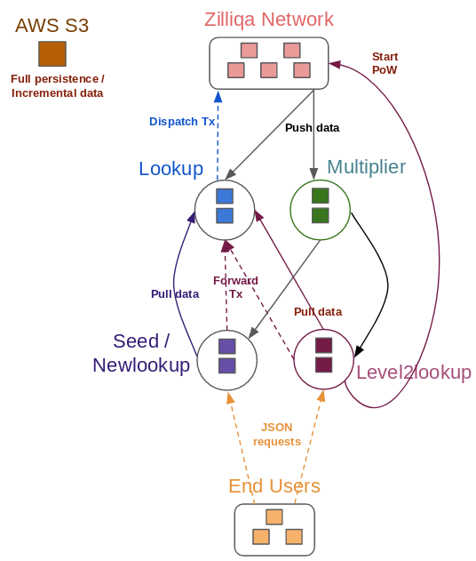

# Network Layout

The image below shows all the different components that comprise the mainnet. The subsections that follow provide a brief description of each component.

## Zilliqa Network

This is composed of the miner nodes (DS and shard), both Zilliqa-owned (i.e., guard nodes) and otherwise. The mainnet is currently configured to have 600 DS committee nodes and a maximum of three 600-node shards.

## Lookup

Lookup nodes are Zilliqa-owned full nodes, which means they store all of the mined blockchain data - including state deltas, transaction bodies, and microblocks.

The mainnet currently has 5 lookup nodes, each one with a specific purpose:

- `lookup-0`: This lookup uploads incremental data to AWS S3 storage after every transaction epoch. It also uploads its entire persistence data after every 80th transaction epoch.
- `lookup-1`: This lookup uploads its entire persistence data to a back-up location in AWS S3 after every 80th transaction epoch.
- `lookup-2` / `lookup-3`: These lookups act as upper seeds to `level2lookup` seed nodes. As upper seeds, they process requests from these seed nodes, including transaction creation and data fetching. Transaction creation requests are dispatched by these lookups to the Zilliqa Network nodes.
- `lookup-4`: This lookup acts as an upper seed to `newlookup` seed nodes. It provides similar services as `lookup-2` and `lookup-3`.

JSON queries are generally not routed to these lookups, to avoid overloading them.

## Level2lookup

`Level2lookup` nodes are essentially seed or archival nodes, i.e., full nodes whose primary purpose is the storage of blockchain data, which they receive from the Zilliqa Network through the multipliers. The mainnet API for JSON queries is configured to use these nodes. Additionally, we use these nodes to provide new miners the signal when to start PoW mining. There are currently 15 `level2lookup` nodes in the mainnet.

## Newlookup

`Newlookup` nodes are also seed nodes, and are intended for use by our partner exchanges. Private API endpoints are assigned to these nodes so that exchanges can perform JSON queries. `Newlookup` nodes are scaled up or down in the mainnet according to our needs.

## Multiplier

A multiplier is a special node whose purpose is to receive data from Zilliqa Network nodes, and then to re-transmit that data to a list of nodes that are registered with it. The mainnet currently has 5 multipliers, with the following assignments normally done:

- `multiplier-0`: Assigned to transmit data to `level2lookup-0` to `level2lookup-4`.
- `multiplier-1`: Assigned to transmit data to `level2lookup-5` to `level2lookup-9`.
- `multiplier-2`: Assigned to transmit data to `level2lookup-10` to `level2lookup-14`.
- `multiplier-3` / `multiplier-4`: Usually configured after bootstrap to transmit data to `newlookup` and exchange-hosted seed nodes.