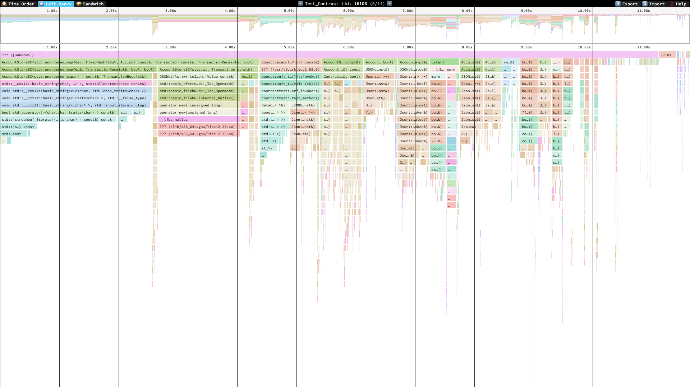

# Profiling Zilliqa and Scilla

This tutorial shows how to profile Zilliqa and Scilla together in a C++ unit test that executes smart contract.

<!-- TOC depthTo:2 -->

- [Requirements](#requirements)
- [Step 0: Setup environment](#step-0-setup-environment)
- [Step 1: Update Zilliqa and Scilla source code](#step-1-update-zilliqa-and-scilla-source-code)
- [Step 2: Run the profiling script](#step-2-run-the-profiling-script)
- [Step 3: View the profiling result](#step-3-view-the-profiling-result)
- [More](#more)
- [References](#references)

<!-- /TOC -->

## Requirements

Ensure you have an Ubuntu OS (16.04 onwards, other OSes are not yet tested).

```console
$ lsb_release -a
No LSB modules are available.
Distributor ID: Ubuntu
Description:    Ubuntu 16.04.3 LTS
Release:        16.04
Codename:       xenial
```

Install [`speedscope`](https://github.com/jlfwong/speedscope) on your machine.

```bash
npm install -g speedscope
```

Get the script `profile.sh` and enter the repository directory.

```bash
git clone https://gist.github.com/Gnnng/e6ae97b2ce31d8f65c8c94a48a95ce94 profile
cd profile
```

## Step 0: Setup environment

You can choose to run the profiling on your machine or in a docker container.

> Using a container saves your time on setting up build environments for Zilliqa and Scilla and also provides an isolated context when running profiling. However, it does not mean any security as it will run in privilege mode for necessary permissions. Also, it might incur unexpected overhead on performance. So the recommendation is starting with the container solution for learning but using the native solution for reliable result.

### Caveat

Some kernel changes are required to run `perf` properly, please be aware of these system-level change and keep the original values if you want to restore the settings. The command `./profile.sh setup` will run these commands to change the kernel settings.

```bash
sysctl -w kernel.perf_event_paranoid=-1
echo 0 | tee /proc/sys/kernel/kptr_restrict
```

### Run in container

Start the container using the following command.

```bash
./profile.sh docker
```

Inside the container, run:

```bash
./profile.sh setup
```

### Run on your machine

Set the directories variables according to your configuration. These are the path to code repositories. Also, make sure you install the build dependencies following the documentation in Zilliqa and Scilla.

```bash
export ZILLIQA_DIR=/the/path/of/zilliqa/directory
export SCILLA_DIR=/the/path/of/scilla/directory
```

Setup your environment for profiling.

```bash
sudo ./profile setup
```

## Step 1: Update Zilliqa and Scilla source code

Remember to update the code to the version you desired to profile. You can modify the source code directly in the referenced code repository. In this tutorial, some changes in Zilliqa are already being made on the branch `feature/perf`.

Let's checkout the branch in Zilliqa repository (e.g., `/zilliqa` in docker).

```cpp
git checkout feature/perf
```

If you are in the container environment, the code repository in `/zilliqa` is a shallow copy. You will need to run this first before checking out a remote branch.

```bash
git config remote.origin.fetch "+refs/heads/*:refs/remotes/origin/*"
git fetch
```

You can also make code change in Scilla repository if you need.

## Step 2: Run the profiling script

Go back to the directory with `profile.sh` and just run:

```bash
./profile.sh run
```

The command `profile.sh run` is a simple wrapper that does the following tasks.

1. Enable smart contract
2. Build Zilliqa test case
3. Build Scilla
4. Profile using `perf`

It calls the unit test located in `tests/`. The default one used here is `Test_Contract` on the branch `feature/perf`, which calls `scilla-runner` to execute a smart contract.

After it finishes, you will see the generated profiling result `cputime.perf`.

## Step 3: View the profiling result

Simply run:

```bash
speedscope cputime.perf
```

> If you are using containers, run this command directly on your machine.

It will open your browser for you. You can find more about how to use it in `speedscope` documentation.



## More

### Tweaking the scripts

The script `profile.sh` is simple, change it for your need.

- `frequency`: This determines the sampling frequency of `perf`.

### Resolving missing symbols

If you see things like `[unknown]` in the profiling result or the stack simply does not make sense, try the following fixes:

1. Re-compile Zilliqa and its dependency (e.g. `g3log`, `libjsoncpp`) with this gcc flag `-fno-omit-frame-pointer`.
2. Add debug symbols to both Zilliqa (e.g. inserting `-g` complier flag  or using Debug build) and Scilla (see this [tip](https://github.com/Zilliqa/scilla/wiki/Profiling-Scilla-:-Tips)).
3. Switch OCaml compiler to the version with frame pointer enabled as per [this doc](https://ocaml.org/learn/tutorials/performance_and_profiling.html#Using-perf-on-Linux).

## References

- [Speedscope](https://github.com/jlfwong/speedscope)
- [Using perf to profile Ocaml](https://ocaml.org/learn/tutorials/performance_and_profiling.html#Using-perf-on-Linux)
- [Install debug symbol packages](https://wiki.ubuntu.com/Debug%20Symbol%20Packages)
- [Fixing Stack Traces](http://www.brendangregg.com/perf.html#StackTraces)
