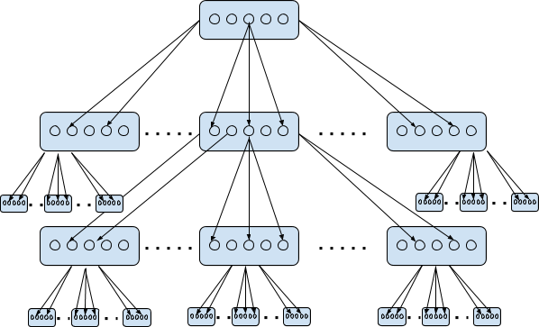

# Tree Based Cluster Broadcasting

This document describes the purpose, implementation details and application of Tree-Based-Cluster-Broadcasting.

## Description

- Gossip / Rumor spreading mechanism is used widely in zilliqa network for messaging. Refer [link](https://github.com/Zilliqa/dev-docs/blob/master/core/gossip-protocol.md) for more details of gossip protocol.
- However gossip protocol at it very basic needs the information of peer to spread the rumor with. This basic requirement of peer's info is available almost every time except when new DS block is mined.
- DS Block contains information of peers belonging to each shard which is leveraged by each node to initialize their peer list and restart gossip engine.
- However, spreading the DS Block itself is problem to be solved. Solution is `Tree-Based-Cluster-Broadcasting`.

## Purpose

In the new DS epoch, before receiving the DS block, a shard node doesn’t know the information of the other nodes in the same shard.
Thus, we should leverage multicast to broadcast the DS block to the nodes within a shard.

## Design

1. Assume that we have `X` nodes in a shard, each cluster has `Y` nodes, a cluster has `Z` children clusters, and every node has its sequence number `n` starting from `0`. `X / Y`  represents `[_X / Y_]`, e.g., `2/10 = 0, 11/10 = 1`.

2. Therefore, we have `X / Y` clusters , say `0 .. X/Y-1`. For a node `n`, it belongs to cluster `n / Y` and it’s at level `log_z(n/Y)`.

3. Then the node will multicast the message to the node `(n/Y * Z + 1)*Y` ~ `((n/Y * Z + Z + 1)* Y - 1)`.
    Bound checks on node index are needed to be done before multicasting. If check fails don’t broadcast.



## Application

Based on above algorithm, below are the parameters which control broadcasting of DSBLOCK by ds-node to all nodes in the shard.

```xml
<data_sharing>
        <BROADCAST_TREEBASED_CLUSTER_MODE>true</BROADCAST_TREEBASED_CLUSTER_MODE>
        <NUM_FORWARDED_BLOCK_RECEIVERS_PER_SHARD>3</NUM_FORWARDED_BLOCK_RECEIVERS_PER_SHARD>
        <MULTICAST_CLUSTER_SIZE>10</MULTICAST_CLUSTER_SIZE>
        <NUM_OF_TREEBASED_CHILD_CLUSTERS>3</NUM_OF_TREEBASED_CHILD_CLUSTERS>
</data_sharing>
```

- `BROADCAST_TREEBASED_CLUSTER_MODE` : Enable/Disable Tree Based Cluster Broadcasting and fallback to pure multicasting.

- `NUM_FORWARDED_BLOCK_RECEIVERS_PER_SHARD` : Number of shard-nodes receiving the DSBLOCK from ds-node initially.

- `MULTICAST_CLUSTER_SIZE` : Number of nodes in each cluster.

- `NUM_OF_TREEBASED_CHILD_CLUSTERS` : Number of child clusters for given cluster.
