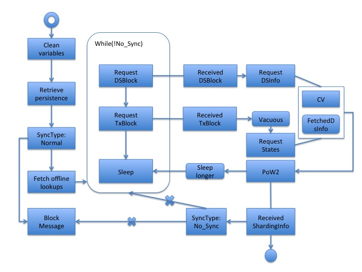

# Recover / Rejoin

  This document will give some useful examples for `recover`, and explain the concept of `rejoin`.

## Recover

  The `recover` is a kubectl-based command that can recover broken node(s) from using a healthy node's persistence. Here is the command prototype:

  ```bash
  ./testnet.sh recover TYPE "INDEX1 INDEX2 INDEX3 ..." [-u UPLOAD_TYPE UPLOAD_INDEX]
  ```

  If not specify `-u`, by default we will use persistence from `lookup-0` for recovering `level2lookup-x`, and use persistence from `level2lookup-0` for recovering al the other nodes.

- Scenario 1:
  If you want to recover `dsguard-0`, please type:
  
  ```bash
  ./testnet.sh recover dsguard 0
  ```

  We don't specify `-u` here, by default it will use persistence from `level2looup-0`.

- Scenario 2:
  If you want to recover `level2lookup-0`, please type:
  
  ```bash
  ./testnet.sh recover level2lookup 0
  ```

  We don't specify `-u` here, by default it will use persistence from `lookup-0`.

- Scenario 3:
  If you want to recover `normal-3`, `normal-55`, `normal-77`, please type:

  ```bash
  ./testnet.sh recover normal "3 55 77"
  ```

  We don't specify `-u` here, by default it will use persistence from `level2looup-0`.

- Scenario 4:
  If you want to recover `normal-0` using `dsguard-3`, please type:
  
  ```bash
  ./testnet.sh recover normal 0 -u dsguard 3
  ```

- Scenario 5:
  If you want to recover `normal-0`, `normal-4`, `normal-52` using `lookup-9`, please type:
  
  ```bash
  ./testnet.sh recover normal "0 4 52" -u lookup 9
  ```

## Rejoin

  When following scenario happened, `rejoin` process will be applied.

  - A node is kick-out from network for some reason (e.g., Lose POW, recover)
  - A new node (e.g., community node, `new`/`newlookup` node) want to join to network

  Basically, the `rejoin` will keey fetching necessary information (DS info, DS block, TX block, ...) from a random-selected lookup node, until vacuous epoch. After a new DS epoch, this node may successfully join back to network, or keep trying to rejoin in next DS epoch. Following is the brief flow chart of this idea:



Here is more detail steps for `normal`, `DS`, and `lookup` nodes.

## Normal node

1. Clean variables in Node class
2. Retrieve Persistence Storage
3. Set SyncType to be NORMAL, thus to block some messages that will be received as a healthy normal node
4. Send Request A: Fetch if any lookup nodes are offline
5. Wait Request A feedback with conditional variable CV1.
6. While Loop until SyncType becomes NO_SYNC:
7. Send Request B: Fetch Latest DSBlocks
8. Send Request C: Fetch Latest TxBlocks
9. If PoW2 Started, sleep for BACKUP_POW2_WINDOW_IN_SECONDS, otherwise only NEW_NODE_SYNC_INTERVAL seconds.
10. If the feedback of Request C contains a new TxBlock, check whether it is a vacuous block, if so, send Request D: Fetch latest Account States.
11. If the feedback of Request B contains a new DSBlock, Send Request F: Fetch Latest DS Committee Info.
12. Wait until Request D got feedback, check fetchedDSInfo, if true, start PoW2, otherwise set a conditional variable CV2.
13. Wait until Request F got feedback, if it is not the first time get the Request F feedback && the Request D Started to listen DSInfo Updating && check if the current epoch is still the epoch when the DS committee changed, then notify CV2.
14. When CV2 get notified, start PoW2.
15. Init Mining and submit PoW2.
16. If received sharding information, change SyncType to NO_SYNC. Stop blocking messages. The normal node now successfully joined the network.

## DS node

1. If the DS Node was a DS Leader, it will do view change rather than do recovery as a DS Node. It the process of the DS Leader was killed, it will start joining as a Normal Node if triggered by the Daemon.
2. The steps for DS Node are the same as Normal Node until step 8, besides:
3. The step 2 is to clean the variables in DirectoryService class. 
4. The step 3 is to set SyncType to be DS_SYNC. 
5. The following is the step after step 8.
6. Wait until Request F got feedback, check isFirstLoop: if true, set to false; if false, mark the currDSExpired as true.
7. Wait until Request D got feedback, check if the currDSExpired, if false, change the SyncType to NO_SYNC, reset isFirstLoop to true, start RunConsensuOnDSBlock with no PoW1 submission.
8. This is to make sure the DS Node will declare its success of joining before the new DS Committee generated, then it’s legible to participant the DS Committee Consensus.

## Lookup node

1. Most of the steps for Lookup Node are the same as DS Node excludes:
2. At the beginning, the lookup node will tell the other lookup nodes that it will be offline.
3. The last step is to call RSync to get the latest TxBodies.Then set the SyncType to NO_SYNC, and tell the other lookup nodes it will be online.
