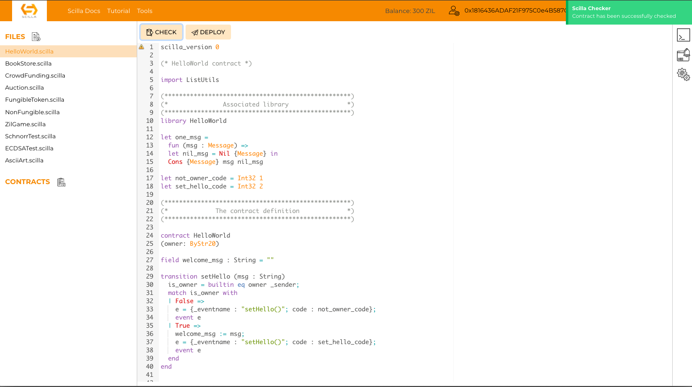

---

In this section, we will deploy and interact with a `Hello World` smart contract
onto the Zilliqa testnet using [Neo-Savant web IDE](https://ide.zilliqa.com/#/)
and [ZilPay wallet](https://zilpay.xyz/).

## Create Testnet Wallet using ZilPay

ZilPay is an [open source](https://github.com/zilpay/zil-pay) browser add-on
that manages a user’s Zilliqa wallet and can be used on Chrome, Firefox and
Opera browsers. It does not store any user's private keys on the server.
Instead, they are password protected and stored on browser storage. It is a
non-custodial wallet, meaning, only the user has full access and responsibility
for their private key.

To create a ZilPay wallet:

1.  Visit ZilPay's [website](https://zilpay.xyz/) and download the extension for
    your respective browser.
2.  Open the extension, create a new wallet by verifying your 12 words recovery
    phrase and selecting a password for your wallet. !!! note

           Please store your 12 words recovery phrase securely

3.  Click on the `network change` button (shown below) and select the `network`
    as testnet.

Voila! You have now successfully set up a testnet ZilPay wallet.

## Request Testnet $ZIL from Faucet

Deploying a contract to zilliqa's testnet will consume gas. As such you will
need testnet $ZIL in your ZilPay account to pay for the gas.

To request for testnet $ZIL from the faucet,

1. Visit [Nucleus wallet testnet faucet](https://dev-wallet.zilliqa.com/faucet)
2. Enter and submit your ZilPay address to the faucet, you will receive 300
   testnet $ZIL shortly. This will take about 30s to 1 min, as the transactions
   will need to be confirmed on the blockchain.

## Deploying Contract on Testnet

To deploy the `Hello World` contract on the Zilliqa testnet, we will use the
Scilla web IDE, [Neo-Savant IDE](https://ide.zilliqa.com/).

1. Change the `network` to testnet and import your wallet by connecting with
   Zilpay.

2. Select the `Hello World` contract under the files tab and click on `Check`
   button to use the
   [typechecker](https://scilla.readthedocs.io/en/latest/scilla-checker.html) to
   check for any syntax errors in your contract.

3. Once the typechecker result is passed, click on `Deploy` button to deploy the
   contract to testnet. Use your wallet address (Base16 format) for the "owner"
   initialisation parameter.

Yay! Your contract is now deployed on the testnet and can be accessed under the
"Contracts" tab on the left side of the IDE.

!!! tip

    To convert from `Bech32` address format into base16 address format, you can use the address converter in the IDE. Click on `Tools > Address converter`.

## Understanding the Hello World Contract

The Hello World contract written in the scilla smart contract programming
language essentially consists of two transitions. The transitions of a scilla
contract define the public interface for the contract and are a way to define
how the state of the contract may change.  The two transitions in the Hello
World are:

1. `setHello()` - `setHello` transition updates the value of the mutable
   variable - 'welcomeMsg' to the value of the transition parameter.
