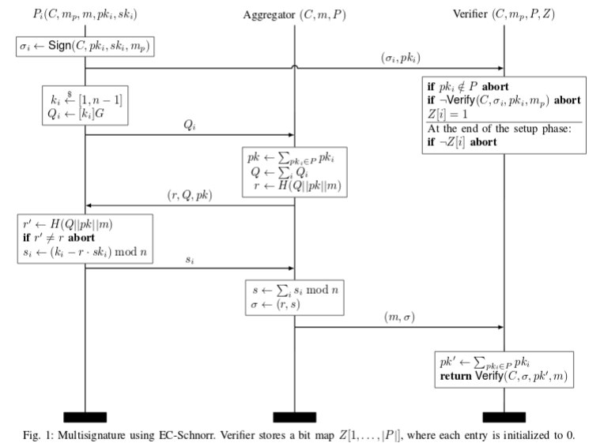
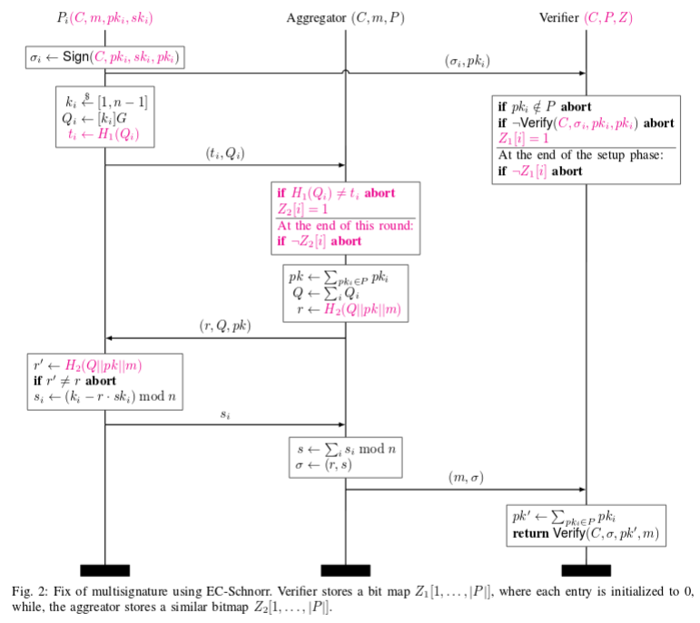

# Multisignatures

## Overview

The end result of any consensus round is basically the generation of an EC-Schnorr signature that is the product of co-signing the consensus data by 2/3+1 of the participants.

This document is a brief description of how multisignatures are implemented and used in the Zilliqa core. For more information on how multisignatures work, refer to the Zilliqa [whitepaper](https://docs.zilliqa.com/whitepaper.pdf).

## Generating the Multisignature within Consensus

1. Leader sends out announcement message, which includes the data to co-sign
1. Backup generates a commit point and commit secret, and sends back the commit point
1. Leader aggregates all the received commit points
1. Leader generates and sends out `challenge = function(aggregated commit points, aggregated public keys, data to co-sign)`
1. Backup re-generates the same challenge on its end and verifies equality
1. Backup generates and sends back `response = function(commit secret, challenge, private key)`
1. Leader verifies each response as `function(response, challenge, public key, commit point)`
1. Leader generates and sends out `signature = function(challenge, aggregated responses)`
1. Both leader and backups verify signature as `function(signature, data to co-sign, aggregated public keys)`

## Implementation Details

The cryptographic components needed for multisignatures are implemented across `Schnorr.h` and `MultiSig.h`.

One can think of `Schnorr::Sign` as being the unilateral equivalent of the co-signing that is achieved through the aggregation of each participant's `CommitPoint`, `Response`, and `PubKey` components, as well as the indirect use of each participant's `PrivKey` and `CommitSecret` in the process of generating those components.

In fact, you will notice that `MultiSig::MultiSigVerify` is implemented almost the same as `Schnorr::Verify` (with the exception of an added byte for domain separated hash function). This shows that while co-signing is done through some aggregation magic, in the end a multisignature is still a Schnorr signature and can be verified as such.

## Domain-separated Hash Functions

In December 2018, [PR 1097](https://github.com/Zilliqa/Zilliqa/pull/1097) was introduced to address an issue raised during a security audit. The main idea was to make these changes:

```console
1. Leader sends announcement -> no change
2. Backup receives announcement -> no change
3. Backup sends commit + H1(commit)
4. Leader receives commit + checks H1(commit)
5. Leader sends challenge using H2(challenge inputs)
6. Backup receives challenge + checks H2(challenge inputs)
7. Backup sends response -> no change
8. Leader receives response -> no change
9. Leader sends collective sig -> no change

where:
H1(x) = SHA256(0x01||x)
H2(x) = SHA256(0x11||x)
```

This diagram illustrates the original multisignature scheme during consensus:



This diagram illustrates the modified scheme based on the auditor's proposal:



After these changes, we now identify three domains during the consensus protocol. The "separation" per se refers to the integration of unique byte values into hash operations across different points of the consensus, to effectively carve out domains during the consensus.

1. The first domain-separated hash function basically refers to the node submitting its PoW and its public key, or what we now refer to as the Proof-of-Possession (PoP) phase. While no behavioral change is done in the code for the PoW stage, we created a wrapper function `MultiSig::SignKey` to emphasize that by signing the public key, the node is effectively presenting proof of possessing the private key.

1. The second domain-separated hash function refers to the backup having to send the hash of the commit point alongside the commit point itself. To achieve this, the new data structure `CommitPointHash` was added to `MultiSig.h`.

1. The third domain-separated hash function refers to the leader introducing another byte (`0x11`) into the hash operation during the generation of the challenge value.
