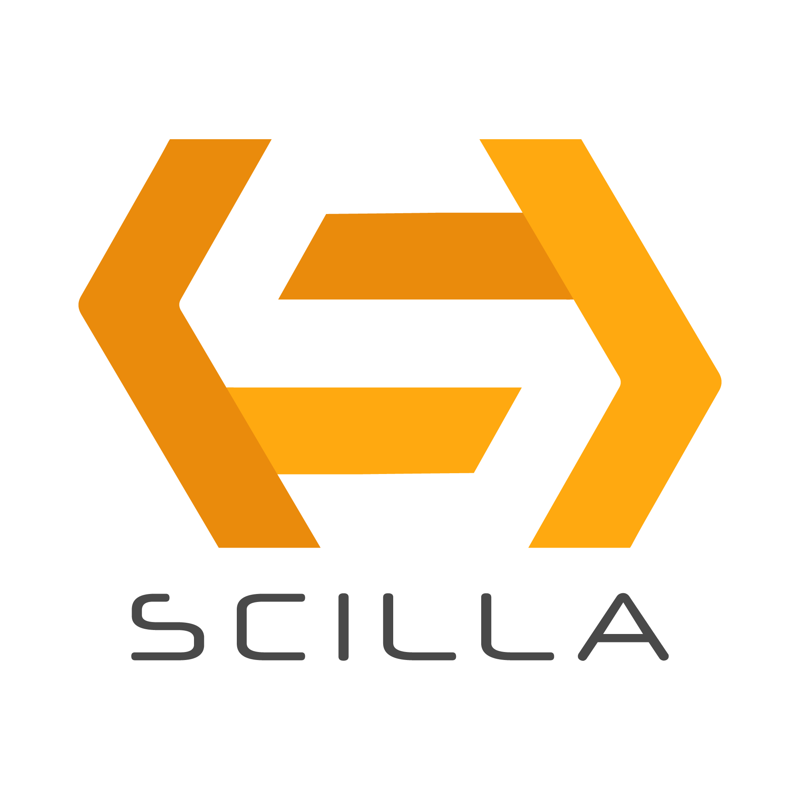

# Scilla

{.align-center
width="100px" height="100px"}

[Scilla]{.title-ref} (short for [Smart Contract Intermediate-Level
LAnguage]{.title-ref}) is an intermediate-level smart contract language being
developed for the [Zilliqa](https://zilliqa.com) blockchain. Scilla is designed
as a principled language with smart contract safety in mind.

Scilla imposes a structure on smart contracts that will make applications less
vulnerable to attacks by eliminating certain known vulnerabilities directly at
the language-level. Furthermore, the principled structure of Scilla will make
applications inherently more secure and amenable to formal verification.

The language is being developed hand-in-hand with formalization of its semantics
and its embedding into the [Coq proof assistant](https://coq.inria.fr/) --- a
state-of-the art tool for mechanized proofs about properties of programs. Coq is
based on advanced dependently-typed theory and features a large set of
mathematical libraries. It has been successfully applied previously to implement
certified (i.e., fully mechanically verified) compilers, concurrent and
distributed applications, including blockchains among others.

[Zilliqa]{.title-ref} \-\-- the underlying blockchain platform on which Scilla
contracts are run \-\-- has been designed to be scalable. It employs the idea of
sharding to validate transactions in parallel. Zilliqa has an intrinsic token
named [Zilling]{.title-ref} (ZIL for short) that are required to run smart
contracts on Zilliqa.

## Development Status

Scilla is under active research and development and hence parts of the
specification described in this document are subject to change. Scilla currently
comes with an interpreter binary that has been integrated into two
Scilla-specific web-based IDEs. `trial-label`{.interpreted-text role="ref"}
presents the features of the two IDEs.

## Resources

There are several resources to learn about Scilla and Zilliqa. Some of these are
given below:

### Scilla

: - [Scilla Design Paper](https://ilyasergey.net/papers/scilla-oopsla19.pdf) -
[Scilla Slides](https://drive.google.com/file/d/10gIef8jeoQ2h9kYInvU3s0i5B6Z9syGB/view) -
[Scilla Language Grammar](https://docs.zilliqa.com/scilla-grammar.pdf) -
[Scilla Design Story Piece by Piece: Part 1 (Why do we need a new language?)](https://blog.zilliqa.com/scilla-design-story-piece-by-piece-part-1-why-do-we-need-a-new-language-27d5f14ae661)

### Zilliqa

: -
[The Zilliqa Design Story Piece by Piece: Part 1 (Network Sharding)](https://blog.zilliqa.com/https-blog-zilliqa-com-the-zilliqa-design-story-piece-by-piece-part1-d9cb32ea1e65) -
[The Zilliqa Design Story Piece by Piece: Part 2 (Consensus Protocol)](https://blog.zilliqa.com/the-zilliqa-design-story-piece-by-piece-part-2-consensus-protocol-e38f6bf566e3) -
[The Zilliqa Design Story Piece by Piece: Part 3 (Making Consensus Efficient)](https://blog.zilliqa.com/the-zilliqa-design-story-piece-by-piece-part-3-making-consensus-efficient-7a9c569a8f0e) -
[Technical Whitepaper](https://docs.zilliqa.com/whitepaper.pdf) -
[The Not-So-Short Zilliqa Technical FAQ](https://docs.zilliqa.com/techfaq.pdf)

## Contents

::: {.toctree maxdepth="3"} intro scilla-trial scilla-by-example scilla-in-depth
stdlib scilla-tips-and-tricks scilla-checker interface contact :::
