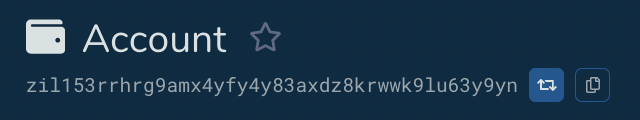
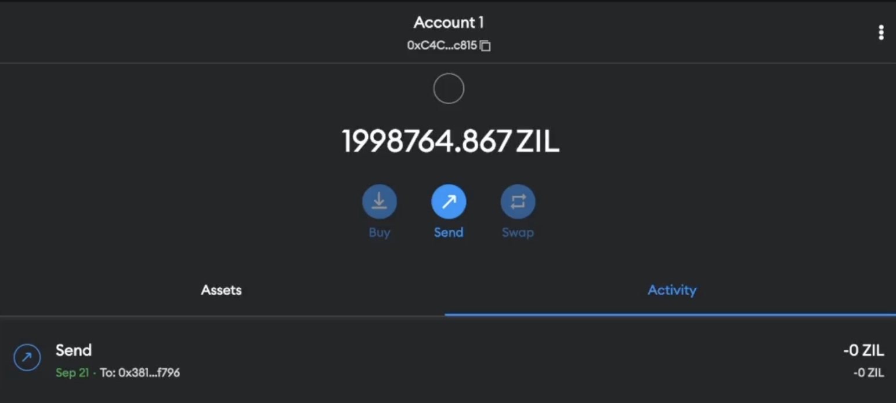

---

## MetaMask

!!! warning

    Your seed phrase must be backed up and kept secret. Funds can be at
    risk if this phrase cannot be recalled or exposed publically.

    Your Zilliqa seed phrase and your EVM seed phrases are different!
    Your existing Scilla keys WILL NOT resolve to the same ZILEVM address.

!!! info

    If you already have Ledger/Metamask - you can use the existing seed
    phrase to generate the same wallet addresses used on other EVM chains.

!!! tip

    You can send funds between EVM and Zilliqa format APIs translating
    your Zilliqa address into it's base 16 representation which
    Metamask can understand.

### Configure MetaMask with ZILEVM network

To add a new network to MetaMask - click the current network selected at the top
of the extenstion and press 'Add Network'.

Enter the below configuration:

| Network Type | Network Name | Network RPC                                                | ChainID | Currency Symbol | Block Explorer URL                                           |
| ------------ | ------------ | ---------------------------------------------------------- | ------- | --------------- | ------------------------------------------------------------ |
| Testnet      | EVM Test     | [https://dev-api.zilliqa.com](https://dev-api.zilliqa.com) | 33101   | ZIL             | [https://evmx-dev.zilliqa.com](https://evmx-dev.zilliqa.com) |
| Mainnet      | EVM Mainnet  | [https://api.zilliqa.com](https://api.zilliqa.com)         | 32769   | ZIL             | [https://evmx.zilliqa.com](https://evmx.zilliqa.com)]        |

### Sending funds

Do not send Zilliqa NFTs or fungible tokens to EVM addresses and vice-versa. You will lose your assets - see the [FAQ](../../faq/faq-introduction.md).

#### Converting addresses

Navigate to [https://devex.zilliqa.com/address/](https://devex.zilliqa.com/address/) to convert using either a ZIL bech32 address or a base16 address.

By pressing the convert button, we can turn a bech32 address (zil...) into a base16 address(0x...), and vice-versa.

#### ZIL -> EVM

If you know the Metamask base16 address (0x...) we want to send funds to, we need to convert that into a bech32 address(zil...) with devex.

You can then use ZilPay to transfer funds to that bech32 address.

#### ZILEVM -> ZIL

If we know the Zilliqa bech32 address (zil...) we want to send funds to, we need to convert that to a base16 address(0x...) - again, devex can do this for you.

Once we have the converted wallet address starting 0x... - Metamask can be used like normal to send funds to a Zilliqa address.

#### EVM -> EVM

Once Metamask has been configured with EVM network details, you can send ZIL to other base 16 addresses (0x...).

!!! warning

    Remember that, as always, if you send funds to an address that no-one has the private key for, they will be lost!

#### EVM testnet faucet

You can use the [testnet
faucet](../../developers/developer-toolings/dev-tools-faucet.md) to
add ZIL to your EVM account - just paste your base-16 address into the
form.
