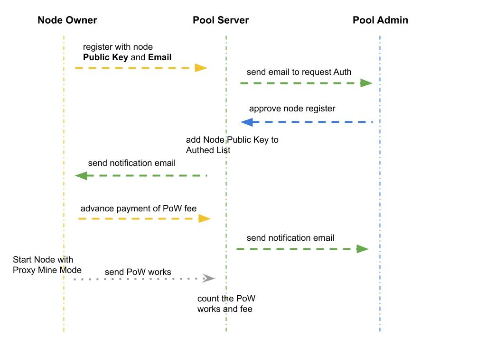
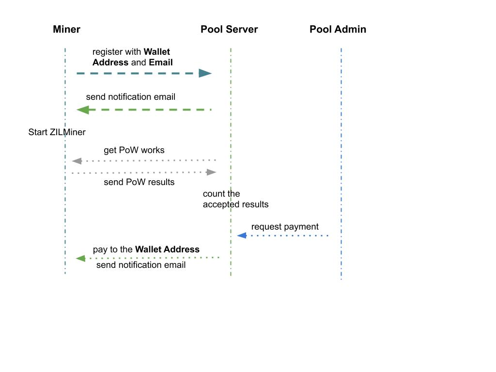

# Zilliqa Mining Proxy

A mining proxy between [Zilliqa](https://zilliqa.com/) CPU nodes and GPU mining rigs. This proxy only runs on a machine with a public IP address. The public IP address is required for both the Zilliqa CPU nodes and GPU mining rigs to connect to it.

## Setup architecture

The setup architecture is illustrated in the image shown below. All communications amongst these three parties are via the JSON-RPC protocol.

- The CPUs in the CPU cluster will be running the [**Zilliqa clients**](https://github.com/Zilliqa/Zilliqa) to process transactions and carry out the pBFT consensus to receive rewards.
- The GPU rigs in the GPU cluster will run the [**Zilminer**](https://github.com/DurianStallSingapore/ZILMiner/) software to do the PoW process and provide PoW solutions to CPU cluster via the Mining proxy server.
- The Mining proxy server will process the mining request from the CPU cluster and handle the Mining Register/Response from the GPU cluster.

## Messages from Zilliqa nodes to Mining Proxy

### zil_requestWork

Zilliqa node assigns the PoW work package to the mining proxy, the message includes the hash of the current block, the seedHash, and the boundary condition to be met ("target"), mining time window. If within the mining time window, the miner didn’t finish PoW, it needs to return a response to Zilliqa node, but set first return parameter to false means mining is failed.

#### Parameters: Array with the following properties

- **DATA, 33 Bytes** - the Zilliqa node PubKey

- **DATA, 32 Bytes** - current block header pow-hash

- **Block Number, 8 Bytes** - the DS block number

- **DATA, 32 Bytes** - the boundary condition ("target"), 2^256 / difficulty

- **Timeout, 4 Bytes** - hexadecimal string, the mining time in seconds. If within this time window the PoW solution failed to mine out, return mining failed result

- **DATA, 64 Bytes** - the signature of the message

#### Returns

- **Boolean** - the result of the request

#### Example

"params": [
"0x0200DA41ADE7291EE9DD37E8A226CD9695C286896553B2F2E67A3CE97C8E85CE05",
"0x1234567890abcdef1234567890abcdef1234567890abcdef1234567890abcdef",
“0x00000000000000FF”,
"0xd1ff1c01710000000000000000000000d1ff1c01710000000000000000000000",
“0x00000080”, "0x00000000000000000000000000000000000000000000000000000000000000000000000000000000000000000000000000000000000000000000000000000000"
]

### zil_checkWorkStatus

Zilliqa nodes use this API to inquiry if the requested PoW is finished or not. The node may query every 1 or 2 seconds.

#### Parameters: Array with the following properties

- **DATA, 33 Bytes** - the Zilliqa node PubKey

- **DATA, 32 Bytes** - current block header pow-hash

- **DATA, 32 Bytes** - the boundary condition ("target")

- **DATA, 64 Bytes** - the signature of the message

#### Returns: Array of the following results

- **Boolean, 1 Bytes** - mining is successful

- **DATA, 8 Bytes** - The nonce found (64 bits)

- **DATA, 32 Bytes** - The header's pow-hash (256 bits)

- **DATA, 32 Bytes** - The mix digest (256 bits)

### zil_verifyResult

After Zilliqa node receive the PoW from the mining proxy, it will do a verification on the result. If the result is pass, it will send true to mining proxy, then mining proxy can record this PoW as verified.

#### Parameters: Array with the following properties

- **DATA, 33 Bytes** - the Zilliqa node PubKey

- **Boolean, 1 Bytes** - the PoW verify pass or fail

- **DATA, 32 Bytes** - The header's pow-hash (256 bits)

- **DATA, 32 Bytes** - the boundary condition ("target")

- **DATA, 64 Bytes** - the signature of the message

#### Returns

- **Boolean** - returns true if submitting went through successfully and false otherwise.

## Messages from Miner to Mining Proxy(Reuse the eth get work messages)

### eth_getWork

Returns the hash of the current block, the seedHash, and the boundary condition to be met ("target").

#### Parameters

- **none**

#### Returns

- **Array** - Array with the following properties:

- **DATA, 32 Bytes** - current block header pow-hash

- **DATA, 32 Bytes** - the seed hash used for the DAG. The epoch number can convert from it

- **DATA, 32 Bytes** - the boundary condition ("target"), 2^256 / difficulty.

Example  
// Request  
curl -X POST --data '{"jsonrpc":"2.0","method":"eth_getWork","params":[],"id":73}'

// Result  
{
"id":1,
"jsonrpc":"2.0",
"result": [
"0x1234567890abcdef1234567890abcdef1234567890abcdef1234567890abcdef",
"0x5EED00000000000000000000000000005EED0000000000000000000000000000",
"0xd1ff1c01710000000000000000000000d1ff1c01710000000000000000000000"
]
}

### eth_submitWork

Used for submitting a proof-of-work solution.

#### Parameters

- **DATA, 8 Bytes** - The nonce found (64 bits)

- **DATA, 32 Bytes** - The header's pow-hash (256 bits)

- **DATA, 32 Bytes** - The mix digest (256 bits)

- **DATA, 32 Bytes** - The boundary condition ("target")

- **DATA, 20 Bytes** - The miner wallet address

- **STR, <64 Bytes** - The miner worker name

Example  
params: [
"0x0000000000000001",
"0x1234567890abcdef1234567890abcdef1234567890abcdef1234567890abcdef",
"0xD1FE5700000000000000000000000000D1FE5700000000000000000000000000",
"0xD1FE5700000000000000000000000000D1FE5700000000000000000000000000",
"0xDE7301972B9649EE31688F291F781396B0F67AD9",
“worker1”
]

#### Returns

- **Boolean** - returns true if the provided solution is valid, otherwise false.

Example  
// Request  
curl -X POST --data '{"jsonrpc":"2.0", "method":"eth_submitWork", "params":["0x0000000000000001", "0x1234567890abcdef1234567890abcdef1234567890abcdef1234567890abcdef", "0xD1GE5700000000000000000000000000D1GE5700000000000000000000000000"],"id":73}'

// Result  
{
"id":73,
"jsonrpc":"2.0",
"result": true
}

### eth_submitHashrate

Used for submitting mining hashrate.

#### Parameters

- **Hashrate** - a hexadecimal string representation (8 bytes) of the hash rate

- **DATA, 20 Bytes** - The miner wallet address

- **STR, <64 Bytes** - The miner worker name

params: [
"0x0000000000000000000000000000000000000000000000000000000000500000",
"0xDE7301972B9649EE31688F291F781396B0F67AD9",
“worker1”
]

#### Returns

- **Boolean** - returns true if submitting went through successfully and false otherwise.

Example  
// Request  
curl -X POST --data '{"jsonrpc":"2.0", "method":"eth_submitHashrate", "params":["0x0000000000000000000000000000000000000000000000000000000000500000", "0x59daa26581d0acd1fce254fb7e85952f4c09d0915afd33d3886cd914bc7d283c"],"id":73}'

// Result  
{
"id":73,
"jsonrpc":"2.0",
"result": true
}

## Zilliqa node and miner management

### Node Register and Payment

### Miner Register and Reward

## Stratum support

On branch feature/stratum, the stratum protocol is supported. The implemented protocol is stratum2 which is proposed by nicehash. The details of the protocol can get from [here](https://github.com/nicehash/Specifications/blob/master/EthereumStratum_NiceHash_v1.0.0.txt).
