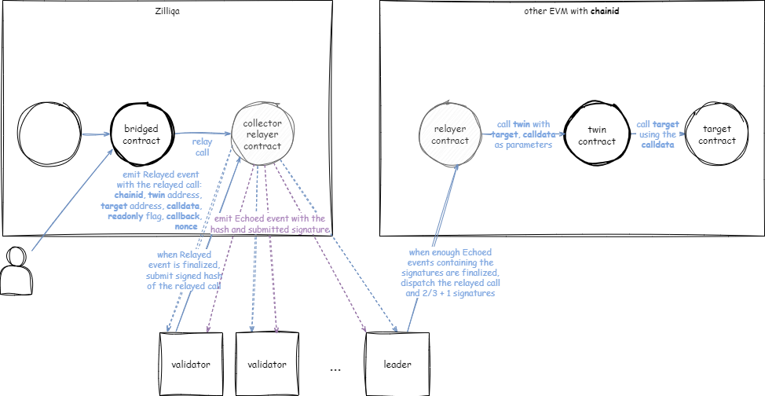
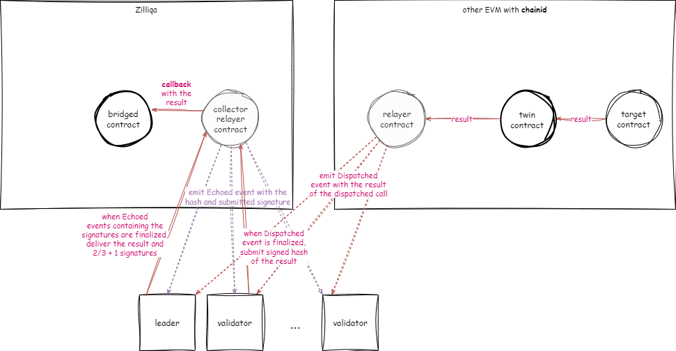
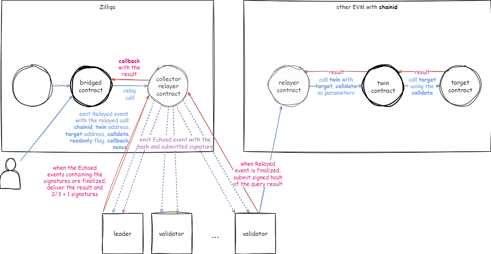
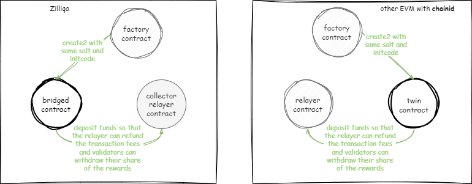
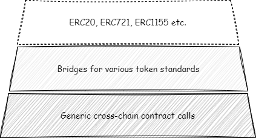
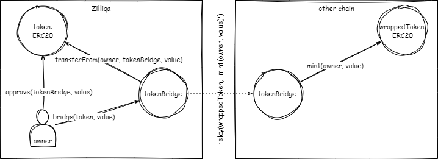
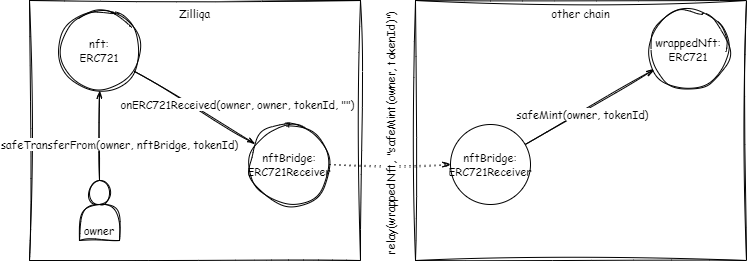
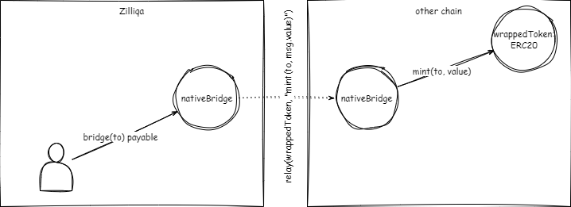

# Universal Cross-Chain Bridge (UCCB)

UCCB allows bridged contracts deployed on the Zilliqa chain to call contracts on other EVM chains. These asynchronous remote calls can be read-only or can modify the state of the target contract. The result of the calls - values returned by the target contract or errors that occured during the calls - are delivered to the caller contract on the Zilliqa chain. The remote calls get dispatched and their results get delivered back to the caller contract only if the supermajority of the Zilliqa validators confirmed them. The confirmations are validator signatures collected on the Zilliqa chain. The bridge can be used bidirectionally i.e. contracts on other EVM chains can also call contracts deployed on the Zilliqa chain.

Note that this is not a trustless bridge. You should only use it if you trust the Zilliqa PoS validators as you will do when using the Zilliqa 2.0 chain.

## Overview

Contracts that want to make remote calls must be deployed on the remote chains at the same address as on Ziliqa. We call the contract deployed on the remote chain a **twin** **contract**. Its role is to forward the remote calls to target contracts from the address of the caller contract deployed on the Zilliqa chain.

Remote calls are relayed by a **relayer** **contract** on the Zilliqa chain and dispatched to the twin by another relayer contract on the remote chain. The caller contract sends the target address, the call data and the callback function selector used for handling the result to the relayer. The relayer contract emits a `Relayed` event containing these data and a nonce. When validators see the event in a finalized block, they confirm the relayed call by signing the hash of the data included in the event.



The relayer contract on the Zilliqa chain is also a **collector** **contract** which receives validator signatures, verifies them against the current validator set and emits an `Echoed` event containing the signed hash and the signature. The validator set is retrieved by calling the collector's `getValidators()` function. When the Zilliqa consensus leader sees that events containing signatures by the supermajority of the validators got finalized, it can dispatch the relayed call by sending it to the relayer on the remote chain along with the signatures of the supermajority. Before doing so, it filters `Dispatched` events emitted by the relayer contract up to the latest block of the remote chain to find out if the previous leaders have already attempted to dispatch the call. If it does not find any event, it submits a transaction to the relay contract and passes the relayed call, its target, callback and nonce as parameters along with the signatures of the supermajorty of validators. The relayer contract verifies the signatures against the current validator set and invokes the twin contract, which sends the call data to the target contract with a gas limit that ensures there is anough gas left to complete the transaction by emitting an event that contains the success flag and the values returned by the target contract or an error that occured.

When the Zilliqa validators see the finalized event, they sign the hash of the success flag, the result and the nonce, and submit their signatures to the collector contract on the Zilliqa chain. When events containing signatures of the supermajority of the validators get finalized, the next leader can submit a transaction that resumes the execution of the caller contract by passing it the result of the remote call. Before doing so, it filters `Resumed` events up to the latest block to check if another leader has already attempted to deliver the result to the caller contract. The success flag and the result are delivered as parameters of a call to a function that was specified by the caller contract as the callback handler.



During the entire process, Zilliqa validators must keep track of pending remote calls. Remote calls can be uniquely identified based on the caller contract and the nonce.

### Read-only Calls

The caller contract can also request a read-only remote call. In this case, the Zilliqa validators can perform the remote call independently from each other, and submit their signed success flags and results to the collector contract on the Zilliqa chain. As soon as the supermajority of them confirmed the result, a leader with deliver it to the caller contract.



### Limitations

There are a few things to keep in mind when designing applications using the protocol:

- the nonce prevents reply attacks but does not impose the ordering of remote calls
- twins have different states on both chains (but they can use remote calls targeted at themselves to exchange relevant storage variables)
- remote calls and the transactions that requested them are not executed atomically (if a remote call does not succeed, the caller contract can request a retry in the callback function)
- if the fallback function reverts, validators will not retry to deliver the result by calling it again

### Deployment

To ensure that twins have the same address on both chains, the prototype deploys them using the same EOA with nonces synced accross chains. This shoud be replaced by counterfactual deployment using a factory contract in the future.



### Incentives

There must be incentives for the validators to confirm and dispatch remote calls and deliver their results. The rewards will be managed by the relay contracts on both chains and will be assigned to validators based on their signatures confirming remote calls and results. Rewards will be deducted from deposits someone must make in advance on behalf of the twins, but twin contracts can use payable function or other means to enforce reimbursement of the costs of remote calls by the users. Furthermore, the relayer cotracts on the respective chain refund the gas used for dispatching remote calls and delivering results to the first validator submitting the corresponding transactions.

## Setup

Clone this repository and install Hardhat and other dependencies:

`npm install`

Start two standalone Hardhat networks:

`npx hardhat node`

`npx hardhat node --port 8546`

Restart the networks if the tests are getting slower.

Alternative, you can change the settings of `net1` and `net2` in `hardhat.config.js` to use the networks of your choice.

If you want to run the tests with accounts other than the default accounts used by Hardhat networks, don't forget to replace the validator set which is currently hardcoded in the `getValidators()` function in `Bridge.sol`.

Run the tests:

`npx hardhat test`

The tests deploy the relayers, twins and target contracts on both networks and mimic the bevavior of validators reacting to events, confirming and dispatching remote calls, and confirming and delivering their results.

## Usage

Bridged contracts must inherit from `Bridged` and receive the relayer address in a call to `setRelayer()` before using remote calls. Afterwards, the bridged contract can request remote calls by calling

```js
uint nonce = relay(target, abi.encodeWithSignature("<FUNCTION SELECTOR>", <PARAMETERS>), readonly, this.<CALLBACK>.selector);
```

where `<FUNCTION SELECTOR>` is the string form of the selector of a function implemented by the target contract that will be called with the list of `<PARAMETERS>` as specified, and `<CALLBACK>` is the name of a function implemented by the current contract that will receive the result of the remote call:

```js
function <CALLBACK>(bool success, bytes calldata result, uint nonce) public onlyRelayer {
    if (success) {
        (<VARIABLES>) = abi.decode(result, (<TYPES>));
        ...
    } else {
        bytes4 sig = bytes4(res[:4]);
        bytes memory err = bytes(res[4:]);
        string memory str = abi.decode(err, (string));
        ...
    }
}
```

where `<TYPES>` is a list of the data types of the values returned by the function of the target contract specified above and `<VARIABLES>` is a list of local variables to store the decoded values. The data types of `<VARIABLES>` must be the same as specified in `<TYPES>`. The `sig` variable contains the first 4 bytes of `keccak256("Error(string)")` or the same for a custom error signature. The `err` variable contains the ABI encoded parameters defined by the custom error or the single `string` value which is decoded and stored in the `str` variable in case there are no other parameters. The `nonce` can be used to assign the result values to a remote call instance as multiple transactions can trigger simultaneous remote calls which are identical except for the nonce. The `onlyRelayer` modifier ensures that the function can only be called by the relayer.

## Testing

The `utils.js` file contains functions that can be used to mimic the behavior of validator during testing:

- `obtainCalls()` to retrieve relayed calls from the events emitted by the relayer
- `confirmCall()` to submit signatures confirming a relayed call
- `queryCall()` to call a requested view function of a target contract
- `dispatchCall()` to dispatch a relayed call to a target contract in a transaction
- `confirmResult()` to submit signatures confirming the results of a relayed call
- `deliverResuult()` to deliver the results by calling the specified callback function

Furthermore, the `switchNetwork()` function allows to switch between the Zilliqa chain (1) and the remote chain (2). Due to changing the network used by the Hardhat Runtime Environment, there are a few limitations with regards to Hardhat tests:

- The Hardhat gas reporter doesn't work, it prints an empty table. However, the relevant transactions can be easily identified in the output of the standalone networks based on console.log followed by the function names, to find out how much gas they consumed.
- Hardhat fixtures can't be used as the logs on the chain that was not selected by the switch are preserved across tests and make the tests interfere with each other.

## Security

Some of the anticipated vulnerabilities and attack vectors:

- the leader on the Zilliqa 2.0 chain rotates every 2s, but the blocks of the other EVM chain take longer (e.g. 12s for the Ethereum Mainnet), therefore if the first leader dispatches a call, the next few leaders could miss the Dispatched event in the pending block on the other EVM chain
  - at worst, multiple honest validators attempt to dispatch the same call and pay a small fee as the relayer will only refund the first one and revert the redundant transactions
- a malicious leader can neglect to dispatch the call and allege it didn't know the blocks containing the echos had already been finalized
  - sooner or later a honest leader will dispatch the signatures so malicious leaders can only delay but not prevent it
- a malicious validator can dispatch a call without being the leader or before the blocks containing the echoes get finalized
  - the malicious validator dispatching the call won't earn more than the other validators that provided a signature, it only gets refunded the portion of the gas fees that were spent during dispatching the call but not before or after that
- twin contracts that can call malicious contracts or be malicious themselves and try to drain the balance of the leader dispatching the call
  - the relayer calls the twin contract with gas limited to the twin's deposit, and as the twin can't cause the transaction to revert, the relayer will always refund the gas fees from the twin's deposit

## Performance

Cross-chain calls incur both a delay and a cost overhead.

When sending from Zilliqa 2.0 to another chain, the **minimum delay** is 5 blocks because

- the finalization of the event emitted by the relayer contract takes +2 block cycles
- the finalization of the signatures submitted by the validators take +2 block cycles

In the opposite direction, the finality of the other chain applies at the first point above.

The **gas overhead** is as follows:

- approx. 33k gas per validator signature submitted on Zilliqa 2.0 costs 0.15 ZIL or 0.0025 USD
- approx. 123k + 4.2k gas per signature verified on the target chain

On Ethereum as target chain, the second point above would currently cost around 0.00086 ETH or 1.41 USD + 0.00003 ETH or 0.05 USD per signature

## Future Improvements

Features to be implemented include:

- **Validator compensation**: manage deposits made on behalf of twin contracts, deduct payments for relayed calls and assign them as rewards to validators based on their confirmations, enable withdrawal of rewards, and refund the gas fee to the first validator dispatching the relayed call or delivering its result
- **Bridge deployment**: add a factory for counterfactual deployment of bridged contracts at the same address on all chains (which requires the initcode passed to the factory to contain the same argument values on all chains)
- **Proof of Stake support**: validator signatures should be weighted by their stake, and the supermajority met when more than 2/3 of the stake held by the validator set has confirmed a relayed call or its result
- **Multichain support**: add the chainid as an argument to the relay requests and events to let the validators know on which chain to dispatch, along with the relayer address to ensure that the call gets dispatched via the prefered relayer contract
- **Gas settings**: add gas limit and gas price to the relay requests and events that shall be applied in the calls on the target chain
- **Multicall support**: implement support for multicalls i.e. multiple targets (with the same chainid) and calls relayed to them
- **Batching support**: implement batching of relay events so that validators can confirm all of them at once by signing the root of the Merkle tree containing all events from the same finalized block

## Applications

Everything described above is the bottom layer in the following design:



The middle layer are cross-chain applications that use the cross-chain conctract calls enabled by the bottom layer. Typical examples are token bridges introduced in more detail below. The top layer are existing fungible tokens and NFTs that can use the specific token bridge.

### `ERC20` token bridge

- the token holder approves the bridge contract and calls it to bridge the approved amount
- the bridge contract transfers the amount to itself and triggers a remote call to its twin
- the twin contract mints the same amount of the wrapped `ERC20` token to the token holder's address
- the bridge contract emits an event in the callback function to inform the token holder
- to transfer an amount back to the Zilliqa chain, a remote call in the other direction is used and the wrapped token is burned on the remote chain and the same amount of the original token is unlocked on Zilliqa
  

### `ERC721` or `ERC1155` token bridges can be implemented with a shortcut

- the token holder transfers the token to the bridge contract which implements `ERC721Receiver` or `ERC1155Receiver` respectively
- the bridge contract triggers a remote call to its twin when `onER721Received()` or `onERC1155Received()` is called
- the rest works as described for `ERC20` above
  

### Native token bridge

- the token holder calls a payable function of a the bridge contract to transfer some amount
- the bridge contract triggers a remote call to its twin
- the rest works as described for `ERC20` above
  

### Atomic token swaps

- user 1 approves the swap contract on Zilliqa and calls it to swap the approved amount against some amount of another token on the other chain before the swap expires
- the swap contract transfers the approved amount of user 1 token to itself and triggers a remote call to its twin, which stores the pending swap
- user 2 approves the twin contract on the other chain and calls it to swap the approved amount against the token of user 1
- the twin contract checks the expiration and whether the approved token and amount are as required, transfers the amount to user 1 and returns true as response
- the swap contract on Zilliqa receives the response of its twin and transfers the locked amount to user 2
- if the swap contract does not receive a response from its twin before the expiration, user 1 can claim the approved amount and the swap contract sends it back to user 1

## Roadmap

The bridge will have the following deliverables:

- **Smart Contracts** – these will be written with the combination of:
  - Hardhat - E2E testing + deployment
  - Foundry - Unit testing + fuzzing + invariant testing + gas reporting
- **Validator Node Lib**
  - Written in Rust
  - Should encapsulate most functionality required for a validator to run the bridge protocol
- **Off-chain Validator Nodes**
  - Written in Rust
  - Will use `Validator Node Lib` as a dependency for most shared code
  - This will run the validator set
  - Signature aggregation through a gossip network
  - Validators run by Zilliqa
- **Frontend DApp**
  - Written in React
  - Simple DApp enabling bridge activities
- **Integrate bridge into ZQ2 consensus**
  - Integrate `Validator Node Lib`
  - Migrate validators to ZQ2 once released and stable

### MVP

The MVP bridge will run on a gossip network with validators managed by Zilliqa

- [ ] **Smart Contracts** - on hardhat (E2E testing & deployment) + foundry (Unit testing + fuzzing)
  - [x] Integrate foundry to support effective unit testing on contracts
  - [x] Finish remaining TODO tests
  - [x] Update error handling on contracts
  - [x] Integrate mechanism for gas reversal
  - [x] Multichain support - appending chain-ids to event calls
  - [x] CI automated testing
  - [x] Gas limit parameters for dispatch
  - [x] Move resume from core to periphery
  - [x] Update interface to support cross-shard
  - [x] Add cross-shard support for contracts
  - [x] Global nonces
  - [x] Remove Collector
  - [ ] Validator rewards for txns
  - [ ] Update periphery contracts
    - [ ] Split bridged incoming and outgoing interfaces
    - [ ] Support response instead of fire&forget
  - [x] Update foundry tests
  - [ ] Update hardhat tests
  - [ ] Synchronizing validators cross-chain
    - [ ] Update validator set
  - [-] Fuzz + invariant testing
  - [ ] Write deployment scripts
    - [ ] Support CREATE2
    - [ ] [Deterministic Deployment Proxy](https://github.com/Arachnid/deterministic-deployment-proxy)
  - [ ] Track last event block number for light client event censorship resistance
- [ ] **Off-Chain Validator Nodes** & **Validator Node Lib**
  - Binary and lib would be developed together. Lib will be refactored out later to be used for ZQ2
  - [ ] P2P network for sharing signatures - [rust-libp2p](https://github.com/libp2p/rust-libp2p)
  - [ ] Read & Write to chains
  - [ ] Validator slashing
  - [ ] Integrate into ZQ2 consensus network to share signatures
  - [ ] Periodic gas refund for validators
  - [ ] Light client implementation
    - [ ] Determine type of connection to use to connect to non-zilliqa chains
    - [ ] Zilliqa maintained full nodes of non-zq chain. UCCB validators use light nodes on it
    - [ ] Check logsBloom for potential events in the block
    - [ ] Retrieve block receipts, check for logs and verify receipt root
- [ ] **Frontend DApp**
  - [ ] Boilerplate setup (Vite React with Rainbow Kit)
