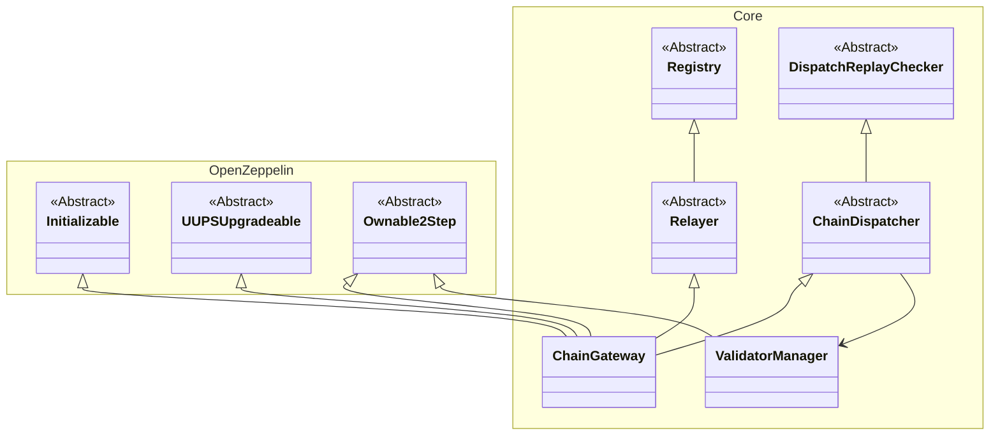
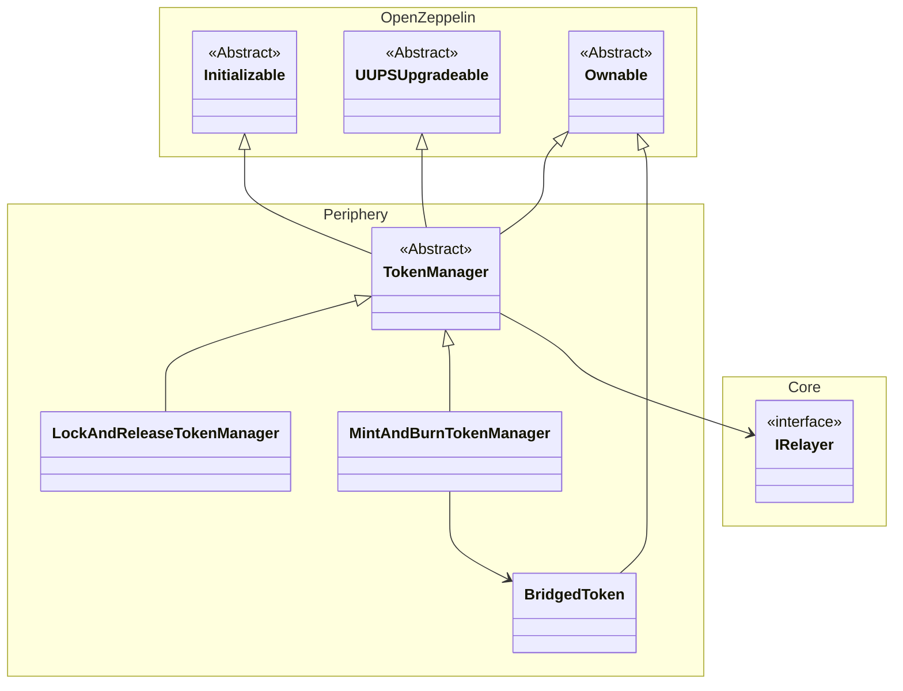

# UCCB Contracts

The contracts are split into 2 sections:

Core: contains the UCCB contracts that need to be deployed on every chain that is supported by the system

- This is able to handle arbitrary messages being sent cross-chain
- There is also the core-upgradeable version implemented later and currently live in production

Contracts:

- `Relayer`: handles outbound message requests from the source chain to a remote one
  - `Registry`: lists the set of contracts that can call the relayer to emit outbound message requests
- `ChainDispatcher`: handles incoming message requests from the remote chain
  - `DispatchReplayChecker`: contains helper functions used to prevent repeated messages from being sent
- `ValidatorManager`: contains the list of UCCB validators. it is used by `ChainDispatcher` to verify incoming message requests
- `ChainGateway`: inherits from both `Relayer` and `ChainDispatcher` to handle cross-chain messaging



Periphery: contains contracts that specify specific cross-chain communication protocols. Currently it features the following protocol (more can be extended in the future):

- It current features a LockAndRelease + MintAndBurn bridge setup
  - Where the original token is hosted on the LockAndReleaseManager
  - Then a bridged token is hosted on the counterparty chain with the MintAndBurnManager
  - This allows tokens to be bridged from origin chain to a remote one
- By extending `TokenManager` new types of token bridges can be created. Each bridge should have a pair of contracts inherited from TokenManager

Contracts:

- `TokenManager`: the main contract that contains are the interfacing with the `IRelayer` which is the `Relayer`'s interface in order to send outbound or receive inbound messsages cross-chain.
  - Since each bridge is a pair, the tokens have to be registered on both sides such that the request to bridge is validated correctly.
- `LockAndReleaseTokenManager`: locks tokens from the locally and sends cross-chain message to mint on the other side and releases locked tokens when it has an incoming message.
- `MintAndBurnTokenManager`: is responsible to Mint and Burn of the `BridgedToken`. It is also capable of deploying new `BridgedToken`
  - `BridgedToken`: is an implementation of an ERC20 token that can be minted and burned on demand of an owner. Usually this owner is set to the `MintAndBurnTokenManager`



## Deployments

### Core

When new chains are supported on the network new deployments of the core contracts have to be re-deployed there.
Refer to [deployCoreUpgradeable.s.sol](../script/bsc/deployCoreUpgradeable.s.sol) as an example of deployment. All contracts have been migrated to the upgradeable version currently.
For a new chain it is recommended to duplicate the existing folder for an existing chain and rename the folder with the
chain name.

Deployment instructions are as follows

1. Update `.env` file as specified in the script (e.g. PRIVATE_KEY_OWNER) which is necessary to assign ownership of contracts upon deployment. (In the future deployments should refer to [private key management](https://book.getfoundry.sh/tutorials/best-practices#private-key-management))
2. Set `tokenManager` inside the `deployCoreUpgradeable.s.sol`. If necessary to register a new contract whitelisted on `ChainGateway`
3. Run the deployment scripts as follows:

   For ZQ1:

   ```bash
   forge script script/zq/deploy/deployCoreUpgradeable.s.sol:Deployment --fork-url <RPC_URL> --broadcast --legacy
   ```

   For other chains:

   ```bash
   forge script script/bsc/deploy/deployCoreUpgradeable.s.sol:Deployment --fork-url <RPC_URL> --broadcast
   ```

   Note that ZQ1 only supports legacy type transactions. Also it does not have the deterministic deployment proxy so it deploys without it, whilst other chains will deploy with a deterministic deployment proxy.

   The script will deploy `ChainGateway` and `ValidatorManager` contracts which make up the core set of contracts

### Periphery

Currently periphery only features ERC20 bridge that is `LockAndRelease` on one end and `MintAndBurn` on the other. On one side it will deploy a lock and release native tokens, on the other it will mint and burn a bridged token that is deployed solely for this purpose.

To deploy the `TokenManagers` on new chains the `LockAndReleaseTokenManagerUpgradeableV3` and `MintAndBurnTokenManagerUpgradeableV3` on each end of the chain if not already there. The initializer function needs to be added to these functions to initialize the owner and setting the gateways necessary. Then a new deployment script can be created and used accordingly.

## Creating custom cross-chain messaging protocols

Essentially there are 2 main interfaces on contracts that need to be satisfied to send a cross-chain message from a source chain to the target chain:

- The source chain should call the `ChainGateway.relay` function

  ```solidity
  contract Sender {
    ChainGateway chainGateway = 0x000...;

    function sendToTarget() external {
      uint targetChainId = 12;
      address target = 0x000...; // The contract that will receive the call
      uint amount = 100;
      bytes memory call = abi.encodeWithSignature("receiveFromSource(uint256)", amount);
      uint gasLimit = 100_000;
      chainGateway.relay(targetChainId, target, call, gasLimit);
    }
  }
  ```

- The target chain should have the external function that is able to receive the message (The chaingateway should be able to call it):

  ```solidity
  contract Receiver {
    event Received(uint amount);

    function receiveFromSource(uint amount) external {
      emit Received(amount)
    }
  }
  ```

As you can see above in the example `Sender` contract holds the `chainGateway` address such it it can call it to notify the validator nodes about which event they want to send and to which chain. Despite calling it message passing, essentially it tries to execute the instruction on the target contract.

To enable 2 way communication then both you just have to make both of these contracts symmetric.

Sometimes we want to also get some extra metadata such as the sender address or the nonce of the dispatch transaction. This can be achieved by using `relayWithMetadata` instead.

```solidity
struct Receive {
  uint amount
}

contract Sender {
  ChainGateway chainGateway = 0x000...;

  function sendToTarget() external {
    uint targetChainId = 12;
    address target = 0x000...; // The contract that will receive the call
    uint amount = 100;
    bytes4 selector = Receiver.receiveFromSource.selector;
    bytes memory data = abi.encode(Receive(amount));
    uint gasLimit = 100_000;
    chainGateway.relay(targetChainId, target, selector, data, gasLimit);
  }
}
```

```solidity
struct CallMetadata {
    uint sourceChainId;
    address sender;
}

contract Receiver {
  event Received(address sender, uint amount);

  function receiveFromSource(CallMetadata calldata metadata, bytes calldata data) external {
    Receive memory args = abi.decode(data, (Receive));
    emit Received(metadata.sourceChainId, metadata.sender, args.amount);
  }
}
```

This approach is a bit more limiting as it requires a stricter abi on the `Receiver` contract. But in return we get the message sender and source chain id. Which is useful to ensure that the incoming call originated from the trusted contract and not by a malicious user and not from the wrong chain. This is whats currently used in the `periphery` contracts for the `TokenManager`.

Note as well that the `Receive` struct is flexible and can be anything depending on the application. This serves as the payload for the information that needs to be sent across chain.

## Testing information

Once the bridge infrastructure has been setup as according to [here](../bridge-validators/README.md), use the following test commands:

1. Deploy contracts on both chains:

```sh
# Deploy on chainid 1
forge script script/deploy.s.sol:Deployment --fork-url http://localhost:8545 --broadcast
```

```sh
# Deploy on chainid 2
forge script script/deploy.s.sol:Deployment --fork-url http://localhost:8546 --broadcast
```

2.Run `relay` to relay messages across:

```sh
# Send message from chain 1 to 2
forge script script/relay.s.sol:Relay --fork-url http://localhost:8545 --broadcast
```

```sh
# Send message from chain 2 to 1
forge script script/relay.s.sol:Relay --fork-url http://localhost:8546 --broadcast
```

3.Verify if test relay had worked:

```sh
# Verify message received in chain 1 from 2
 forge script script/verify.s.sol:Verify --fork-url http://localhost:8545 --broadcast
```

```sh
# Verify message received in chain 2 from 1
 forge script script/verify.s.sol:Verify --fork-url http://localhost:8546 --broadcast
```

Depending on how many times relay has been run, it should show that many times on the respective target chains

## Contract Addresses

### Zilliqa Mainnet

- `ChainId`: 32769
- `ChainGateway`: `0xbA44BC29371E19117DA666B729A1c6e1b35DDb40`
- `ValidatorManager`: `0x71f3AD7cA177818399C9d79d74A6b284E4BEAAc9`
- `LockAndReleaseTokenManager`: `0x6D61eFb60C17979816E4cE12CD5D29054E755948`

Deterministic deployer not available, simple CREATE was used

### BSC Mainnet

- `ChainId`: 56
- `ChainGateway`: `0x3967f1a272Ed007e6B6471b942d655C802b42009`
- `ValidatorManager`: `0x936feD44EC4F46CE08158B536Df2f864c30C4b5F`
- `MintAndBurnTokenManager`: `0xF391A1Ee7b3ccad9a9451D2B7460Ac646F899f23`

`ChainGateway` and `ValidatorManager` were deployed using deterministic deployer [0x4e59b44847b379578588920ca78fbf26c0b4956c](https://github.com/Arachnid/deterministic-deployment-proxy). The salt used was `zilliqa`

### Zilliqa Testnet

- `ChainId`: 33101
- `ChainGateway`: `0x7370e69565BB2313C4dA12F9062C282513919230`
- `ValidatorManager`: `0x782F8afa1bA3137a214D49840688215a8A379fA8`
- `LockAndReleaseTokenManager`: `0x1509988c41f02014aA59d455c6a0D67b5b50f129`
- `TestTokenZRC2Proxy`: `0x8618d39a8276D931603c6Bc7306af6A53aD2F1F3`

Deterministic deployer not available, simple CREATE was used

### BSC Testnet

- `ChainId`: 97
- `ChainGateway`: `0xa9A14C90e53EdCD89dFd201A3bF94D867f8098fE`
- `ValidatorManager`: `0xCc1CB36d981ae2907cea385F615e879434D20B1C`
- `MintAndBurnTokenManager`: `0xA6D73210AF20a59832F264fbD991D2abf28401d0`
- `BridgedTestToken`: `0x5190e8b4Bbe8C3a732BAdB600b57fD42ACbB9F4B`
