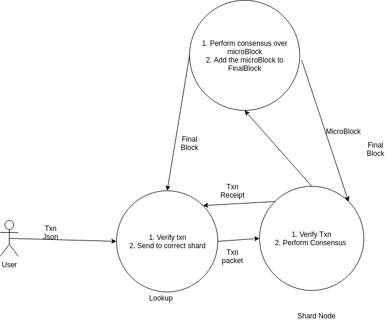

# Transaction Dispatch

## Steps

1. User using the json rpc server sends a json to the Zilliqa api (calls the CreateTransaction function). The transaction json contains essential information about the transaction.
2. The transaction json is then validated and then converted into the cpp class format.
3. The lookup node then decides the shard of the txn to send to and stores the txn into a map. The key of the map is the shard number.
4. After the lookup receives a ds or tx block, it dispatches these txns to the corresponding shards.
5. After it reaches a shard, the shard node again validates this txn and then adds it to the txn mempool.
6. The shard leader then proposes the list of txns to be included in the microblock, the other shard nodes then verify the corresponding txns.
7. If the microblock is then included in the final block, the nodes commits the txns and sends the txn receipts to the lookup.
8. The lookup use this receipt to tell the user the status of the txn.

